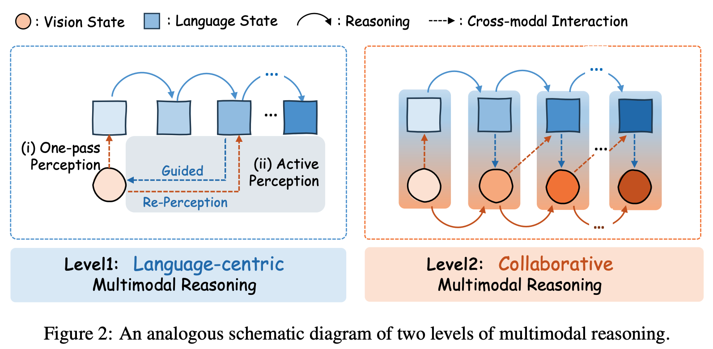
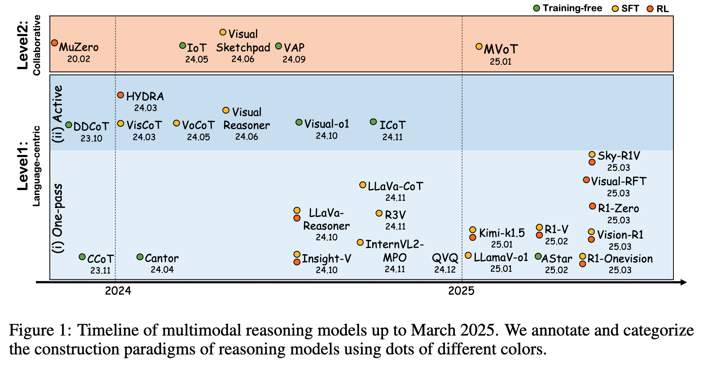

# Mind with eyes: From Language Reasoning to Multimodal Reasoning

This repository will continuously update the latest Papers, technical reports, benchmarks about multimodal reasoning!

## 🎇 Introduction

The rapid advancements in language reasoning have significantly accelerated progress in multimodal reasoning. This survey provides a systematic overview of the latest multimodal reasoning approaches and benchmark datasets, categorizing existing methods into two paradigms: **language-centric multimodal reasoning** and **collaborative multimodal reasoning**. The former encompasses one-pass visual perception and active visual perception, where vision primarily serves a supporting role in reasoning. The latter involves action generation and state updates, enabling a more dynamic interaction between modalities. Furthermore, we analyze the technical evolution of these methods, discuss their inherent challenges, and introduce key benchmark tasks and evaluation metrics for assessing multimodal reasoning performance.

## 📢 Updates

- ✨ **2025.03.21**: The [Paper] is now available in [arxiv]().
- 🚀 **2025.03.15**: We released this repo.

## 📚 Table of Contents
- [1. Language-centric Multimodal Reasoning](#1-language-centric-multimodal-reasoning)
  - [a. One-pass Visual Perception](#a-one-pass-visual-perception)
  - [b. Active Visual Perception](#b-active-visual-perception)
- [2. Collaborative Multimodal Reasoning](#2-collaborative-multimodal-reasoning)
- [3. Benchmarks on Multimodal Reasoning](#3-benchmarks-on-multimodal-reasoning)

## 📖  1. Language-centric Multimodal Reasoning

### 📝  One-pass Visual Perception
* [2502] [R1-Onevision：An Open-Source Multimodal Large Language Model Capable of Deep Reasoning] (R1-Onevision) [[Paper]](https://yangyi-vai.notion.site/r1-onevision) [[Code]](https://github.com/Fancy-MLLM/R1-Onevision)
* [2502] [R1-V: Reinforcing Super Generalization Ability in Vision Language Models with Less Than $3] (R1-V) [[Code]](https://github.com/Deep-Agent/R1-V)
* [2502] [Boosting Multimodal Reasoning with MCTS-Automated Structured Thinking] [[Paper]](https://arxiv.org/abs/2502.02339)
* [2501] [LlamaV-o1: Rethinking Step-by-step Visual Reasoning in LLM] (LlamaV-o1) [[Paper]](https://arxiv.org/abs/2501.06186) [[Code]](https://github.com/mbzuai-oryx/LlamaV-o1)
* [2501] [Kimi k1.5: Scaling Reinforcement Learning with Large Language Models] (Kimi k1.5) [[Paper]](https://arxiv.org/abs/2501.12599) [[Code]](https://github.com/moonshotai/kimi-k1.5)
* [2412] [Mulberry: Empowering MLLM with o1-like Reasoning and Reflection via Collective Monte Carlo Tree Search] (Mulberry) [[Paper]](https://arxiv.org/abs/2412.18319) [[Code]](https://github.com/HJYao00/Mulberry)
* [2411] [LLaVA-CoT: Let Vision Language Models Reason Step-by-Step] (LLaVA-CoT) [[Paper]](https://arxiv.org/abs/2411.10440) [[Code]](https://github.com/PKU-YuanGroup/LLaVA-CoT)
* [2411] [Insight-V: Exploring Long-Chain Visual Reasoning with Multimodal Large Language Models] (Insight-V) [[Paper]](https://arxiv.org/abs/2411.14432) [[Code]](https://github.com/dongyh20/Insight-V)
* [2411] [Enhancing the Reasoning Ability of Multimodal Large Language Models via Mixed Preference Optimization] [[Paper]](https://arxiv.org/abs/2411.10442) [[Code]](https://github.com/OpenGVLab/InternVL/tree/main/internvl_chat/shell/internvl2.0_mpo)
* [2411] [Vision-Language Models Can Self-Improve Reasoning via Reflection] () [[Paper]](https://arxiv.org/abs/2411.00855) [[Code]](https://github.com/njucckevin/MM-Self-Improve)
* [2410] [Improve Vision Language Model Chain-of-thought Reasoning] [[Paper]](https://arxiv.org/abs/2410.16198) [[Code]](https://github.com/riflezhang/llava-reasoner-dpo)
* [2404] [Cantor:Inspiring Multimodal Chain-of-Thought of MLLM] (Cantor) [[Paper]](https://arxiv.org/abs/2404.16033) [[Code]](https://github.com/ggg0919/cantor)
* [2403] [Visual CoT: Advancing Multi-Modal Language Models  with a Comprehensive Dataset and Benchmark for Chain-of-Thought Reasoning] (Visual CoT) [[Paper]](https://arxiv.org/abs/2403.16999) [[Code]](https://github.com/deepcs233/Visual-CoT)
* [2311] [Compositional Chain-of-Thought Prompting for Large Multimodal Models] [[Paper]](https://arxiv.org/abs/2311.17076) [[Code]](https://github.com/chancharikmitra/ccot)

### 📝  Active Visual Perception
* [2411] [Interleaved-Modal Chain-of-Thought] [[Paper]](https://arxiv.org/abs/2411.19488)
* [2410] [Visual-o1: Understanding ambiguous instructions via multi-modal multi-turn chain-of-thoughts reasoning] (Visual-o1) [[Paper]](https://arxiv.org/abs/2410.03321)
* [2408] [Visual Agents As Fast And Slow Thinkers] (sys2-llava) [[Paper]](https://arxiv.org/abs/2408.08862) [[Code]](https://github.com/guangyans/sys2-llava)
* [2406] [From the Least to the Most: Building a Plug-and-Play Visual Reasoner via  Data Synthesis] (VisualReasoner) [[Paper]](https://arxiv.org/abs/2406.19934) [[Code]](https://github.com/steven-ccq/VisualReasoner)
* [2405] [VoCoT: Unleashing Visually Grounded Multi-Step Reasoning in Large Multi-Modal Models] (VoCoT) [[Paper]](https://arxiv.org/abs/2405.16919) [[Code]](https://github.com/RupertLuo/VoCoT)
* [2403] [HYDRA: A Hyper Agent for Dynamic Compositional Visual Reasoning] (HYDRA) [[Paper]](https://www.ecva.net/[Paper]s/eccv_2024/[Paper]s_ECCV/[Paper]s/03012.pdf) [[Code]](https://github.com/ControlNet/HYDRA)
* [2310] [DDCoT: Duty-Distinct Chain-of-Thought Prompting for Multimodal Reasoning in Language Models] (DDCoT) [[Paper]](https://arxiv.org/abs/2310.16436) [[Code]](https://github.com/SooLab/DDCOT)

## 🚀  2. Collaborative Multimodal Reasoning
* [2502] [Investigating Inference-time Scaling for Chain of Multi-modal Thought: A Preliminary Study] [[Paper]](https://arxiv.org/abs/2502.11514)
* [2501] [Imagine while Reasoning in Space: Multimodal Visualization-of-Thought] (MVoT) [[Paper]](https://arxiv.org/abs/2501.07542)
* [2409] [Enhancing LLM Reasoning via Vision-Augmented Prompting] [[Paper]](https://arxiv.org/html/2409.13980v1) [[Code]](https://cvr-llm.github.io/)
* [2406] [Visual SKETCHPAD: Sketching as a Visual Chain of Thought for Multimodal Language Models] (Visual SKETCHPAD) [[Paper]](https://arxiv.org/abs/2406.09403) [[Code]](https://github.com/Yushi-Hu/VisualSketchpad)
* [2405] [Image-of-Thought Prompting for Visual Reasoning Refinement in Multimodal Large Language Models] (IoT) [[Paper]](https://arxiv.org/abs/2405.13872)

## 📊  3. Benchmarks on Multimodal Reasoning

* [2502] [Multimodal Inconsistency Reasoning (MMIR): A New Benchmark for Multimodal Reasoning Models] (MMIR) [[Paper]](https://arxiv.org/abs/2502.16033) [[Code]](https://github.com/eric-ai-lab/MMIR)
* [2502] [ZeroBench: An Impossible Visual Benchmark for Contemporary Large Multimodal Models] (ZeroBench) [[Paper]](https://arxiv.org/abs/2502.09696) [[Code]](https://github.com/jonathan-roberts1/zerobench)
* [2502] [MME-CoT: Benchmarking Chain-of-Thought in Large Multimodal Models for Reasoning Quality, Robustness, and Efficiency] (MME-CoT) [[Paper]](https://arxiv.org/abs/2502.09621) [[Code]](https://github.com/CaraJ7/MME-CoT)
* [2502] [MM-IQ: Benchmarking Human-Like Abstraction and Reasoning in Multimodal Models] (MM-IQ) [[Paper]](https://arxiv.org/abs/2502.00698) [[Code]](https://github.com/AceCHQ/MMIQ)
* [2501] [Can MLLMs Reason in Multimodality? EMMA: An Enhanced MultiModal ReAsoning Benchmark] (EMMA) [[Paper]](https://arxiv.org/abs/2501.05444) [[Code]](https://github.com/hychaochao/EMMA)
* [2501] [URSA: Understanding and Verifying Chain-of-thought Reasoning in Multimodal Mathematics] (URSA) [[Paper]](https://arxiv.org/abs/2501.04686) [[Code]](https://github.com/URSA-MATH/URSA-MATH)
* [2412] [VISCO: Benchmarking Fine-Grained Critique and Correction Towards Self-Improvement in Visual Reasoning] (VISCO) [[Paper]](https://arxiv.org/abs/2412.02172) [[Code]](https://github.com/PlusLabNLP/VISCO)
* [2406] [Is A Picture Worth A Thousand Words? Delving Into Spatial Reasoning for Vision Language Models] [[Paper]](https://arxiv.org/abs/2406.14852) [[Code]](https://github.com/jiayuww/SpatialEval)
* [2405] [M3CoT: A Novel Benchmark for Multi-Domain Multi-step Multi-modal Chain-of-Thought] (M3CoT) [[Paper]](https://arxiv.org/abs/2405.16473) [[Code]](https://github.com/LightChen233/M3CoT)
* [2310] [MathVista: Evaluating Math Reasoning in Visual Contexts] (MathVista) [[Paper]](https://arxiv.org/abs/2310.02255) [[Code]](https://github.com/lupantech/MathVista)

---
# 🔗 Other useful links
### Survey
- Multimodal Chain-of-Thought Reasoning: A Comprehensive Survey [[Paper]](https://arxiv.org/pdf/2503.12605)
- From System 1 to System 2: A Survey of Reasoning Large Language Models [[Paper]](https://arxiv.org/abs/2502.17419)
- Rethinking External Slow-Thinking: From Snowball Errors to Probability of Correct Reasoning[[Paper]](https://arxiv.org/abs/2501.15602)
- Towards Reasoning Era: A Survey of Long Chain-of-Thought for Reasoning Large Language Models [[Paper]](https://arxiv.org/abs/2503.09567)
